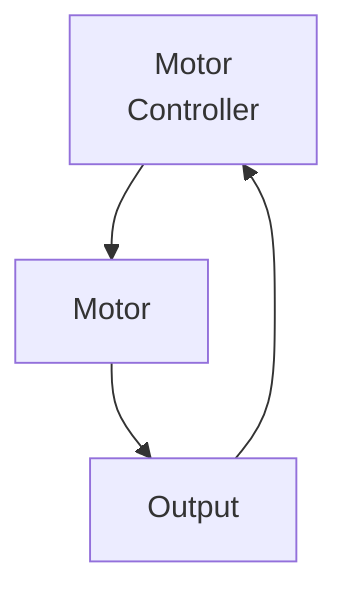

# Closed Loop Control

While open loop control does not check for what happens, (I bet you know already) closed loop does.
This is called feedback and is essential to have accurate positions and speeds. There are many ways this feedback
loop can operate. 

Let's say we want to move our pivot, like on our 2024 season robot. We absolutely **NEED** precise positioning in order to score.
If we were to use open loop control, we can't even tell it to go to position X. (Motors don't understand positions)

The solution is closed loop control and for this we specifically chose a PIDController. 
We will go more into PID in the next section, but what we were able to do, is tell the pivot motor to move to X encoder counts. It calculates the error (how far away it is from the goal), and applies a certain output through PID.
This ensures we get to this position quickly and accurately to actually make our shots.

Here are some of the most common ones that we use. There are likely many more, we just don't utilize them at the moment. 

+ PID
+ Motion Magic