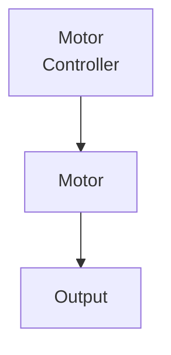

# Open Loop Control (In Progress)

Open loop control is when you command a motor to go to a certain output without ever receiving feedback on whether it is actually there.
A real life example of this could be your oven: you tell it to go to 350 degrees, and it may or may not actually be that.  

In FRC, this is not the most used control type, but we do use it in cases where we don't need precision. For example, telling a motor to spin at 4 volts or 50% power would be examples of this.
This is most useful in cases where the specific speed does not matter, such as spinning intake motors (even then closed loop control may be better).

Diagram:

(Add video example of intake motors)